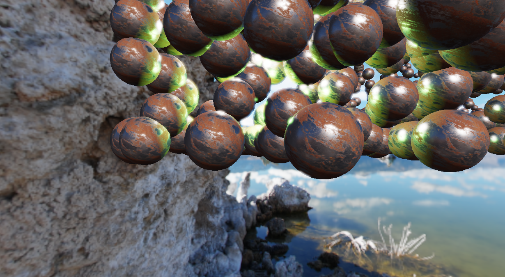
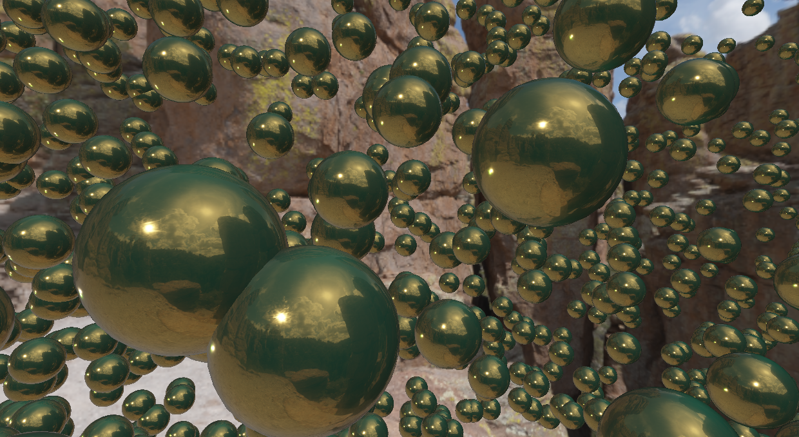
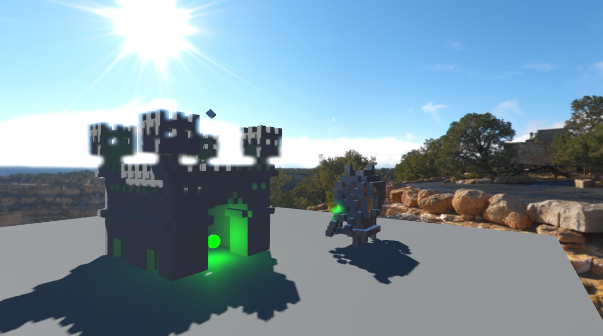
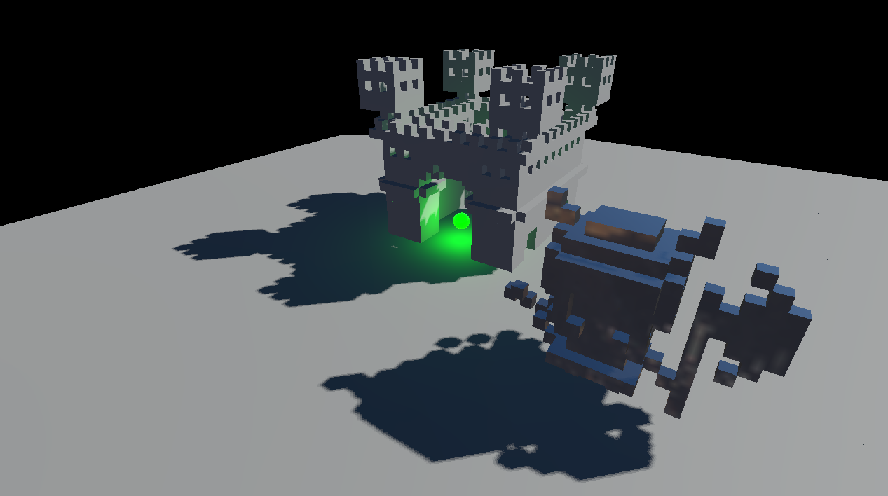

# Render Pipeline

## About

This repository contains the source code of a complete physically-based render pipeline I wrote within an internal but open-sourced project. Because of that, only the pipeline code but non of the other engine code is provided. As a consequence, no project files what so ever are available. Also, third party libraries are missing.

However, this code provides deep insight on how to structure and implement a (very) simple game engine render pipeline. The code is by far not perfect (as code probably never is), but it visualizes how things work. Note that this project was originally thought to render voxels (in this case cubes) only. However, the system has been designed flexible enough to render any kind of geometry.

## Technologies

Languages used for this project:
- C++
- C++/CLI (not available in this repository)
- C# (not available in this repository)
- GLSL

Libraries used for this project:
- OpenGL (glad)
- FBX SDK
- stb_image

## Features

Supported features are:
- Instanced Rendering
- Physically Based Rendering
- Image-Based Lighting
- HDR and Tone Mapping
- Basic Shadow Mapping
- Parallax Occlusion Mapping
- Skybox
- Bloom
- FXAA

## Gallery

Shows how the bloom effect acts in a scene full of spheres.

Shows reflections through image-based lighting on spheres with a highly reflective golden material.

Shows an example scene (rendered with cubes only).

Shows another example scene (rendered with cubes only).

